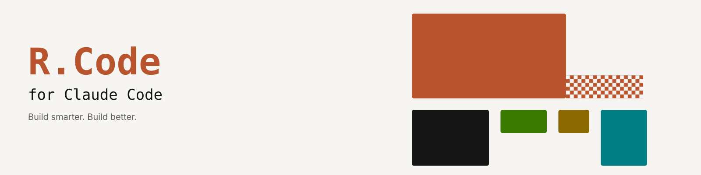
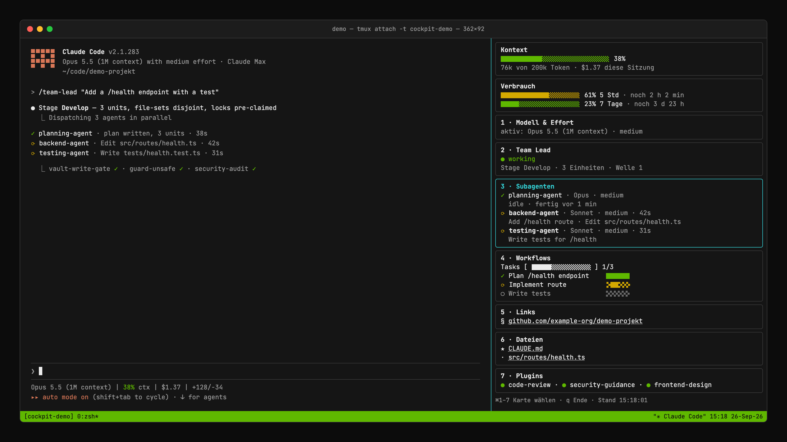
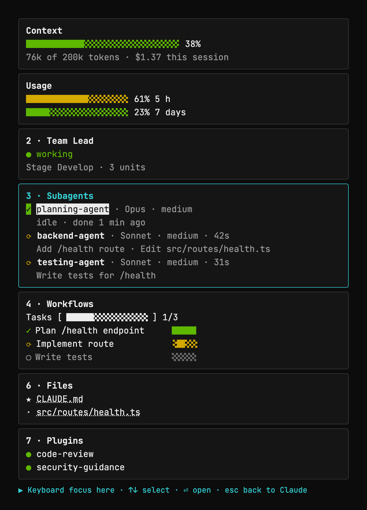
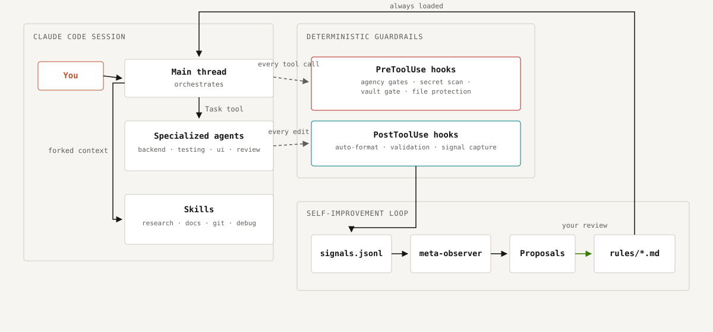

<h1 align="center">
  <picture>
    <source media="(prefers-color-scheme: dark)" srcset="docs/assets/brand/banner-dark.svg">
    
  </picture>
</h1>

<p align="center">
  <strong>R.Code for Claude Code. Build smarter. Build better.</strong><br>
  A complete, portable Claude Code setup: guardrails that hold, a team of specialist agents, a live Cockpit for your terminal — and a framework that never learns your real names.
</p>

<p align="center">
  <a href="LICENSE"></a>
  <a href="#install"></a>
  <a href="https://claude.com/claude-code"></a>
  <a href="https://github.com/emanuelrechsteiner/claude-rcode/releases"></a>
  <a href="https://rcode-for-claude-code.vercel.app/"></a>
</p>

<p align="center">
  <a href="#install">Install</a> ·
  <a href="https://rcode-for-claude-code.vercel.app/cockpit.html">See the Cockpit</a> ·
  <a href="https://rcode-for-claude-code.vercel.app/how-it-works.html">How it works</a>
</p>

## Why R.Code for Claude Code

<table>
<tr>
<td width="50%">
<strong>Guardrails that don't negotiate.</strong><br>
Deterministic gates run before every tool call — no language model in the gate.<br>
Dangerous commands, force-pushes, production migrations and secret leaks are stopped before they run; anything irreversible always gets a human yes/no, even in autonomous mode.
</td>
<td width="50%">
<strong>A team, not a chatbot.</strong><br>
Twelve specialist agents — planning, backend, testing, review, UI, research and more — dispatched in parallel on locked file sets.<br>
<code>/team-lead</code> decomposes the work, delegates it and reviews every wave.
</td>
</tr>
<tr>
<td width="50%">
<strong>See it in the Cockpit.</strong><br>
A tmux sidebar next to Claude Code: context and cost, running subagents, workflow progress, links and files — updated live from the same hooks.<br>
Companion repo: claude-cockpit; screenshots show demo data.
</td>
<td width="50%">
<strong>Pseudonymized by design.</strong><br>
Real project names, machine paths and personal identifiers live only in a local vault.<br>
Every write, every commit and every publish is checked: 0 real values in any tracked file.
</td>
</tr>
</table>

**It learns from the work.** Friction in a session becomes a signal; signals become reviewed proposals; you decide which become rules. Nothing changes the framework without a human.

## See it

R.Code for Claude Code's rules and hooks are invisible until something happens. **Cockpit** is a companion tmux dashboard that makes a session visible while you work — a sidebar pane next to Claude Code showing context/usage, active subagents, workflow progress, and clickable links/files, fed by the same hooks this repo registers. It's optional; nothing in this repo depends on it.

**Set it up** — separately, from its own repo, its own one-liner:

```bash
bash <(curl -fsSL https://raw.githubusercontent.com/emanuelrechsteiner/claude-cockpit/main/install.sh)
```

It installs Ghostty, tmux, Node and `jq` if missing, clones the Cockpit into `~/.claude/cockpit` and runs `npm install`, puts `cockpit` on your `PATH`, registers ten entries (eight hooks, `statusLine`, `subagentStatusLine`) in `~/.claude/settings.json`, and adds the ⌘1–⌘7 shortcuts plus the `rcode` color theme to your Ghostty config. Requirements: macOS, [Ghostty](https://ghostty.org) (the only terminal that sends ⌘1–⌘7 to the cards and matches the theme colors above), tmux ≥ 3.3, and Node ≥ 22. See [Cockpit &middot; set it up](https://rcode-for-claude-code.vercel.app/cockpit.html#setup) for the full step-by-step.

<p align="center">
<br>
<sub><em>Claude Code and the Cockpit side by side in Ghostty. Demo data.</em></sub>
</p>

<table>
<tr>
<td width="50%" align="center">
<br>
<sub>A force-push stopped by the gate — the human decides</sub>
</td>
<td width="50%" align="center">
<br>
<sub><code>/team-lead</code> dispatches a planning, a backend and a testing agent; the Cockpit shows them finish</sub>
</td>
</tr>
</table>

|  |  |
|---|---|

<sub><em>The Cockpit column up close — the selected card carries the focus border. Demo data.</em></sub>

See [claude-cockpit](https://github.com/emanuelrechsteiner/claude-cockpit) for setup and the full keybinding table.

## Install

Install R.Code for Claude Code with one command.

### One-liner (Mac/Linux)

```bash
bash <(curl -fsSL https://raw.githubusercontent.com/emanuelrechsteiner/claude-rcode/main/install.sh)
```

`install.sh` auto-detects the right mode for your machine:

| Detected state | Mode | What happens |
|---|---|---|
| No `~/.claude`, or empty | **fresh** | Clones straight into `~/.claude`, copies templates to `*.local.*` overlays, makes hooks executable |
| `~/.claude` already tracks this repo | **fresh** (self-update) | `git pull` — safe, your `.local.*` files are gitignored and untouched |
| `~/.claude` has unrelated content | asks you | Prompts `overwrite \| augment \| abort` with a recommendation based on what it finds |

Force a mode explicitly with `./install.sh --mode {auto|fresh|overwrite|augment}` (default `auto`):

- **`overwrite`** — backs up your entire existing `~/.claude` to `~/.claude.backup-<timestamp>` (nothing is deleted, only moved), then does a fresh install. Because moving your whole config is a state-changing operation, this always asks for a one-time confirmation, including when `--mode overwrite` is passed directly (skip with `--yes` once you're sure).
- **`augment`** — scans your existing `~/.claude` unit-by-unit (every rule, hook, skill, agent, command, plus your `settings.json`), classifies each unit against what you already have as **new** (safe to add), **identical** (skipped), or **conflicting** (shown as a diff, your call: keep yours / take this repo's / skip). It prints a recommendation based on how much new value would be added versus how much would collide. Nothing is written without your say-so per conflicting file, `settings.json` is never replaced wholesale (only its `hooks` registrations are merged via `jq`, your `env`/`model`/`permissions` stay untouched), and `--dry-run` prints the full report and changes nothing on disk.

### One-liner (Windows PowerShell)

```powershell
iwr -useb https://raw.githubusercontent.com/emanuelrechsteiner/claude-rcode/main/install.ps1 | iex
```

`install.ps1` is a minimal, community-maintained installer: clone/backup only (no `augment` scan-and-merge — that logic is bash-only). The hooks themselves need WSL or Git Bash to execute; PowerShell alone gets you the files, not the automation.

### Manual (works everywhere with git)

```bash
# Mac/Linux:
git clone https://github.com/emanuelrechsteiner/claude-rcode.git ~/.claude

# Windows (PowerShell):
git clone https://github.com/emanuelrechsteiner/claude-rcode.git $HOME\.claude

# Then copy templates to personalize (both platforms):
cp ~/.claude/templates/CLAUDE.local.md.template ~/.claude/CLAUDE.local.md
cp ~/.claude/templates/identity.local.md.template ~/.claude/rules/identity.local.md
```

### Logging in

The installer never touches credentials. On first `claude` launch after install, Claude Code runs its own login flow:

```
Setup complete. Start Claude Code with:  claude
On first launch, Claude Code runs its OWN login flow — choose either:
  • Pro/Max subscription  → browser OAuth (claude.ai)
  • Anthropic API key      → paste when prompted, or export ANTHROPIC_API_KEY
R.Code never stores or reads your credentials.
```

First command after install: `/team-lead "<what you want built>"`.

## What's inside

R.Code for Claude Code ships as plain files — no build step, no binary, nothing to trust beyond what you can read.

| Component | Count | Where |
|-----------|-------|-------|
| Rules (always loaded) | 21 | `rules/*.md` |
| Commands (slash commands) | 22 | `commands/*.md` |
| Skills (on-demand, forked context) | 51 | `skills/*/SKILL.md` |
| Agents (Task tool) | 12 | `agents/*.md` |
| Hooks (lifecycle automation) | 42 | `hooks/*.sh` |
| Scheduled routines | 3 | `scheduled-tasks/*/SKILL.md` |
| Deterministic gates (before risky tool calls) | 14 | `rules/agency-bands.md` |
| Regression suites | 28 (1,100+ assertions) | `hooks/tests/*.sh`, `scripts/tests/*.sh` |
| Templates (starter overlays) | — | `templates/*.template` |
| Examples (worked overlay examples) | — | `examples/*.example` |

Counts are generated by `scripts/framework-inventory.sh`; run it on your install. All 28 regression suites are green before every release.

## How it fits together

<picture>
  <source media="(prefers-color-scheme: dark)" srcset="docs/assets/brand/architecture-dark.svg">
  
</picture>

Rules steer every session, agents do the heavy lifting in isolated contexts, hooks enforce the non-negotiables deterministically (no LLM in the gate), and the observation pipeline turns friction into reviewed rule changes.

### Two ideas worth knowing about before you install

- **Agency bands (AUTO / SOFT-ACK / ESCALATE).** Every tool call is implicitly classified by reversibility, blast-radius, and input trust. Reversible, local, trusted work runs without asking. Anything genuinely irreversible or external — force-push, a production migration, a merge, an outbound message — always gets a real y/n, even in unattended/autonomous runs. See `rules/agency-bands.md`.
- **The observation pipeline.** Edits and session-end events are captured as lightweight signals. When enough accumulate, an on-demand skill (`meta-observer`) synthesizes them into concrete proposals for new or changed rules — R.Code for Claude Code is meant to improve itself from its own friction, reviewed by you before anything lands.

See [`CLAUDE.md`](CLAUDE.md) — R.Code's own onboarding doc — and [`HARNESS.md`](HARNESS.md) for the full system map. Key concept: **you orchestrate, agents execute.**

### Optional: the Hausbau output style

By default, answers are written in normal developer language. `output-styles/hausbau.md` is an opt-in style that explains every technical change through one consistent house-building metaphor — for readers who are not deeply technical (product owners, clients, first-time founders); facts and numbers stay exact, only the language changes. Turn it on with `/output-style Hausbau`.

## Personalize (the `.local.*` overlay pattern)

Personal content lives in gitignored `*.local.md`, `*.local.sh`, `*.local.json` files. The committed repo contains generic versions and templates; you create your own overlays from the templates:

| Template | Copies to | Purpose |
|----------|-----------|---------|
| `templates/CLAUDE.local.md.template` | `~/.claude/CLAUDE.local.md` | Personal additions to the global framework doc |
| `templates/MEMORY_FIRST.local.md.template` | `~/.claude/MEMORY_FIRST.local.md` | Personal context loaded at session start |
| `templates/identity.local.md.template` | `~/.claude/rules/identity.local.md` | Your multiple git identities and which paths trigger which |

`.local.*` files are gitignored — your personal content never gets committed.

> **Note:** there is no `templates/settings.local.json.template`. Claude Code does not read a user-level `settings.local.json` — the `local` settings scope exists only per project (`.claude/settings.local.json` at a repository root), per `code.claude.com/docs/en/settings`. For env vars, see "Required env vars" below.

## Update

Standard git workflow:

```bash
cd ~/.claude
git pull            # pull latest framework updates
```

Your `.local.*` overlays are gitignored and survive every pull.

To contribute improvements upstream:

```bash
cd ~/.claude
git checkout -b improvement/short-description
# ... make your changes ...
git commit -m "feat: ..."
git push origin improvement/short-description
# Then open a PR on GitHub
```

See `CONTRIBUTING.md` for PR conventions.

## Cross-platform notes

| Component | Mac | Linux | Windows |
|-----------|-----|-------|---------|
| Rules, skills, agents, commands | ✓ | ✓ | ✓ |
| YAML routines | ✓ | ✓ | ✓ |
| settings.json / .local.json | ✓ | ✓ | ✓ |
| `.sh` hooks | ✓ | ✓ | Needs WSL or Git Bash |
| `install.sh` | ✓ | ✓ | Needs WSL or Git Bash |
| `install.ps1` | — | — | ✓ Native |

Most config is platform-independent. Hooks are bash scripts and require WSL/Git Bash on Windows. Future versions may add PowerShell hook equivalents.

## Required env vars (for some routines)

**Set these in your shell rc** (`~/.zshrc`, `~/.bashrc`) — that is the mechanism verified to reach Claude Code's tools:

```bash
export CLAUDE_HISTORICAL_SOURCES="$HOME/.claude/projects"
```

| Env Var | Used By | Example |
|---------|---------|---------|
| `CLAUDE_HISTORICAL_SOURCES` | `skills/historical-signals-v2/` | colon-separated paths to additional source dirs |

Two things NOT to do:

- **Do not use `~/.claude/settings.local.json`** — see "Personalize" above; Claude Code silently ignores it at the user level.
- **Do not put secrets in `~/.claude/settings.json`.** Its `env` block *does* work and is the only mechanism that survives a run without a shell profile — but the file is committed to this public repo. Keep secrets in a chmod-600 file exported from your shell rc.

`NOTION_PARENT_PAGE_ID` is no longer an env var: the daily-docs routine now carries its parent page in its own spec (`scheduled-tasks/daily-docs/SKILL.md`), the same decision that file already made for the logbook path — the value is machine-stable and is not a credential.

## Docs

- [`docs/FRAMEWORK-REFERENCE.md`](docs/FRAMEWORK-REFERENCE.md) — full inventory and architecture reference.
- [`docs/adr/`](docs/adr/) — architecture decision records, one per decision.
- [`docs/PUBLISHING.md`](docs/PUBLISHING.md) — how this public repo is built from the maintainer's source.
- [`CONTRIBUTING.md`](CONTRIBUTING.md) — PR conventions.
- [`CHANGELOG.md`](CHANGELOG.md) — release history (Keep a Changelog format).

The original design spec and implementation plan for R.Code for Claude Code are internal, maintainer-facing planning docs and are not part of this public artifact.

## License

MIT — see [`LICENSE`](LICENSE).

## Credits

Built and battle-tested by Emanuel Rechsteiner. Influenced by Anthropic Claude Code docs, the Superpowers plugin ecosystem, and a 1000+ video knowledge base of practitioner workflows.

---

R.Code for Claude Code is an independent, community-maintained open-source project. It is not affiliated with, endorsed by, or sponsored by Anthropic, PBC. "Claude" and "Claude Code" are trademarks of Anthropic, PBC. This project provides configuration files (rules, agents, hooks, skills) for use with Anthropic's Claude Code and claims no rights to those names or logos.
