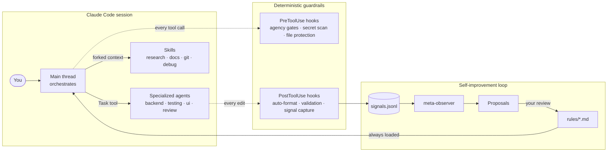
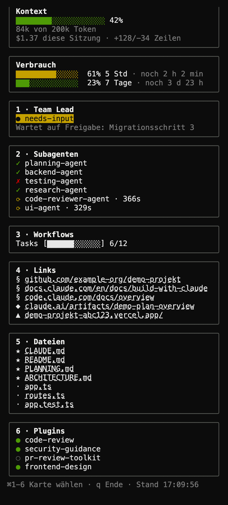

# R.Code

[](LICENSE)
[](#install)
[](https://claude.com/claude-code)

> A complete, cross-platform Claude Code configuration: 23 always-loaded rules, 51 skills, 22 commands, 12 specialized agents, 41 hooks, and 3 scheduled routines. Battle-tested as a personal framework, packaged for portable installation on any machine.

## How it fits together



Rules steer every session, agents do the heavy lifting in isolated contexts, hooks enforce the non-negotiables deterministically (no LLM in the gate), and the observation pipeline turns friction into reviewed rule changes.

## What's in here

| Component | Count | Where |
|-----------|-------|-------|
| Rules (always loaded) | 23 | `rules/*.md` |
| Skills (on-demand, forked context) | 51 | `skills/*/SKILL.md` |
| Commands (slash commands) | 22 | `commands/*.md` |
| Agents (Task tool) | 12 | `agents/*.md` |
| Hooks (lifecycle automation) | 41 | `hooks/*.sh` |
| Routines (scheduled agents) | 3 | `scheduled-tasks/*/SKILL.md` |
| Templates (starter overlays) | — | `templates/*.template` |
| Examples (worked overlay examples) | — | `examples/*.example` |

Counts are measured, not maintained by hand — reproduce them in a fresh clone with
`scripts/framework-inventory.sh`, or directly:

```bash
find rules -maxdepth 1 -name '*.md' -type f | wc -l              # rules
find skills -mindepth 2 -maxdepth 2 -name 'SKILL.md' | wc -l     # skills
find commands -maxdepth 1 -name '*.md' -type f | wc -l           # commands
find agents -maxdepth 1 -name '*.md' -type f | wc -l             # agents
find hooks -maxdepth 1 -name '*.sh' -type f | wc -l              # hooks on disk
```

Hooks on disk (41) and hook *registrations* in `settings.json` (42) differ on
purpose: one script can be registered under several matchers, and a few entries
invoke external binaries rather than a `hooks/*.sh` file. `settings.json` is the
only complete registration truth.

See `CLAUDE.md` for the framework architecture and `HARNESS.md` for the system map.

### Two ideas worth knowing about before you install

- **Agency bands (AUTO / SOFT-ACK / ESCALATE).** Every tool call is implicitly classified by reversibility, blast-radius, and input trust. Reversible, local, trusted work runs without asking. Anything genuinely irreversible or external — force-push, a production migration, a merge, an outbound message — always gets a real y/n, even in unattended/autonomous runs. See `rules/agency-bands.md`.
- **The observation pipeline.** Edits and session-end events are captured as lightweight signals. When enough accumulate, an on-demand skill (`meta-observer`) synthesizes them into concrete proposals for new or changed rules — the framework is meant to improve itself from its own friction, reviewed by you before anything lands.

## See it, not just read about it

Rules and hooks are invisible until something happens. **Cockpit** is a companion tmux dashboard that makes a session visible while you work — a sidebar pane next to Claude Code showing context/usage, active subagents, workflow progress, and clickable links/files, fed by the same hooks this repo registers. It's optional; nothing in this repo depends on it.

| | |
|---|---|
|  | The dashboard column on its own, unfocused — no card is selected yet. Demo data. |
|  | ⌘2 selected the Subagents card (cyan border, first entry highlighted) and moved keyboard focus onto the dashboard — the footer switches to "▶ Tastatur hier" (keyboard is here). Demo data. |

See [claude-cockpit](https://github.com/emanuelrechsteiner/claude-cockpit) for setup and the full keybinding table.

## Install

### One-liner (Mac/Linux)

```bash
bash <(curl -fsSL https://raw.githubusercontent.com/emanuelrechsteiner/claude-rcode/main/install.sh)
```

`install.sh` auto-detects the right mode for your machine:

| Detected state | Mode | What happens |
|---|---|---|
| No `~/.claude`, or empty | **fresh** | Clones straight into `~/.claude`, copies templates to `*.local.*` overlays, makes hooks executable |
| `~/.claude` already tracks this repo | **fresh** (self-update) | `git pull` — safe, your `.local.*` files are gitignored and untouched |
| `~/.claude` has unrelated content | asks you | Prompts `overwrite \| augment \| abort` with a recommendation based on what it finds |

You can also force a mode explicitly: `./install.sh --mode {auto|fresh|overwrite|augment}` (default `auto`).

- **`fresh`** — clone (or self-update) straight into `~/.claude`.
- **`overwrite`** — backs up your entire existing `~/.claude` to `~/.claude.backup-<timestamp>` (nothing is deleted, only moved), then does a fresh install. Because moving your whole config is a state-changing operation, this always asks for a one-time confirmation, including when `--mode overwrite` is passed directly (skip with `--yes` once you're sure).
- **`augment`** — scans your existing `~/.claude` unit-by-unit (every rule, hook, skill, agent, command, plus your `settings.json`), classifies each unit against what you already have as **new** (safe to add), **identical** (skipped), or **conflicting** (shown as a diff, your call: keep yours / take this repo's / skip). It prints a recommendation based on how much new value would be added versus how much would collide. Nothing is written without your say-so per conflicting file, `settings.json` is never replaced wholesale (only its `hooks` registrations are merged via `jq`, your `env`/`model`/`permissions` stay untouched), and `--dry-run` prints the full report and changes nothing on disk.

### One-liner (Windows PowerShell)

```powershell
iwr -useb https://raw.githubusercontent.com/emanuelrechsteiner/claude-rcode/main/install.ps1 | iex
```

`install.ps1` is a minimal, community-maintained installer: clone/backup only (no `augment` scan-and-merge — that logic is bash-only). The hooks themselves need WSL or Git Bash to execute; PowerShell alone gets you the files, not the automation.

### Manual (works everywhere with git)

```bash
# Mac/Linux:
git clone https://github.com/emanuelrechsteiner/claude-rcode.git ~/.claude

# Windows (PowerShell):
git clone https://github.com/emanuelrechsteiner/claude-rcode.git $HOME\.claude

# Then copy templates to personalize (both platforms):
cp ~/.claude/templates/CLAUDE.local.md.template ~/.claude/CLAUDE.local.md
cp ~/.claude/templates/identity.local.md.template ~/.claude/rules/identity.local.md
```

### Logging in

The installer never touches credentials. On first `claude` launch after install, Claude Code runs its own login flow:

```
Setup complete. Start Claude Code with:  claude
On first launch, Claude Code runs its OWN login flow — choose either:
  • Pro/Max subscription  → browser OAuth (claude.ai)
  • Anthropic API key      → paste when prompted, or export ANTHROPIC_API_KEY
R.Code never stores or reads your credentials.
```

## Personalize (the `.local.*` overlay pattern)

Personal content lives in gitignored `*.local.md`, `*.local.sh`, `*.local.json` files. The committed repo contains generic versions and templates; you create your own overlays from the templates:

| Template | Copies to | Purpose |
|----------|-----------|---------|
| `templates/CLAUDE.local.md.template` | `~/.claude/CLAUDE.local.md` | Personal additions to the global framework doc |
| `templates/MEMORY_FIRST.local.md.template` | `~/.claude/MEMORY_FIRST.local.md` | Personal context loaded at session start |
| `templates/identity.local.md.template` | `~/.claude/rules/identity.local.md` | Your multiple git identities and which paths trigger which |

`.local.*` files are gitignored — your personal content never gets committed.

> **Removed 2026-08-04:** this table used to list a
> `templates/settings.local.json.template` → `~/.claude/settings.local.json`.
> **Claude Code does not read that file.** The `local` settings scope exists only
> per project (`.claude/settings.local.json` at a repository root), not at user
> level — see `code.claude.com/docs/en/settings`, confirmed by measurement. Anyone
> following the old instruction configured into the void, and nothing failed to say
> so. For env vars see "Required env vars" below.

## Update

Standard git workflow:

```bash
cd ~/.claude
git pull            # pull latest framework updates
```

Your `.local.*` overlays are gitignored and survive every pull.

To contribute improvements upstream:

```bash
cd ~/.claude
git checkout -b improvement/short-description
# ... make your changes ...
git commit -m "feat: ..."
git push origin improvement/short-description
# Then open a PR on GitHub
```

See `CONTRIBUTING.md` for PR conventions.

## Cross-platform notes

| Component | Mac | Linux | Windows |
|-----------|-----|-------|---------|
| Rules, skills, agents, commands | ✓ | ✓ | ✓ |
| YAML routines | ✓ | ✓ | ✓ |
| settings.json / .local.json | ✓ | ✓ | ✓ |
| `.sh` hooks | ✓ | ✓ | Needs WSL or Git Bash |
| `install.sh` | ✓ | ✓ | Needs WSL or Git Bash |
| `install.ps1` | — | — | ✓ Native |

Most config is platform-independent. Hooks are bash scripts and require WSL/Git Bash on Windows. Future versions may add PowerShell hook equivalents.

## Required env vars (for some routines)

**Set these in your shell rc** (`~/.zshrc`, `~/.bashrc`) — that is the mechanism
verified to reach Claude Code's tools:

```bash
export CLAUDE_HISTORICAL_SOURCES="$HOME/.claude/projects"
```

| Env Var | Used By | Example |
|---------|---------|---------|
| `CLAUDE_HISTORICAL_SOURCES` | `skills/historical-signals-v2/` | colon-separated paths to additional source dirs |

Two things NOT to do:

- **Do not use `~/.claude/settings.local.json`.** Claude Code does not read it (the
  `local` scope is per project only). This was the documented advice until
  2026-08-04 and silently did nothing.
- **Do not put secrets in `~/.claude/settings.json`.** Its `env` block *does* work
  and is the only mechanism that survives a run without a shell profile — but the
  file is committed to this public repo. Keep secrets in a chmod-600 file exported
  from your shell rc.

`NOTION_PARENT_PAGE_ID` is no longer an env var: the daily-docs routine now carries
its parent page in its own spec (`scheduled-tasks/daily-docs/SKILL.md`), the same
decision that file already made for the logbook path — the value is machine-stable
and is not a credential.

## Architecture

See `CLAUDE.md` (the framework's own onboarding doc) and `HARNESS.md` (system architecture). Key concept: **You orchestrate, agents execute.** Heavy implementation goes to specialized agents (Task tool); lightweight diagnostics to forked skills.

## Spec & plan

This repo was designed via a brainstorming session on 2026-05-27. The design spec and implementation plan that came out of that session are internal, maintainer-facing planning docs — they live under `docs/superpowers/` in the private source-of-truth repo and are not part of this public artifact.

## License

MIT — see `LICENSE`.

## Credits

Built and battle-tested by Emanuel Rechsteiner. Influenced by Anthropic Claude Code docs, the Superpowers plugin ecosystem, and a 1000+ video knowledge base of practitioner workflows.
